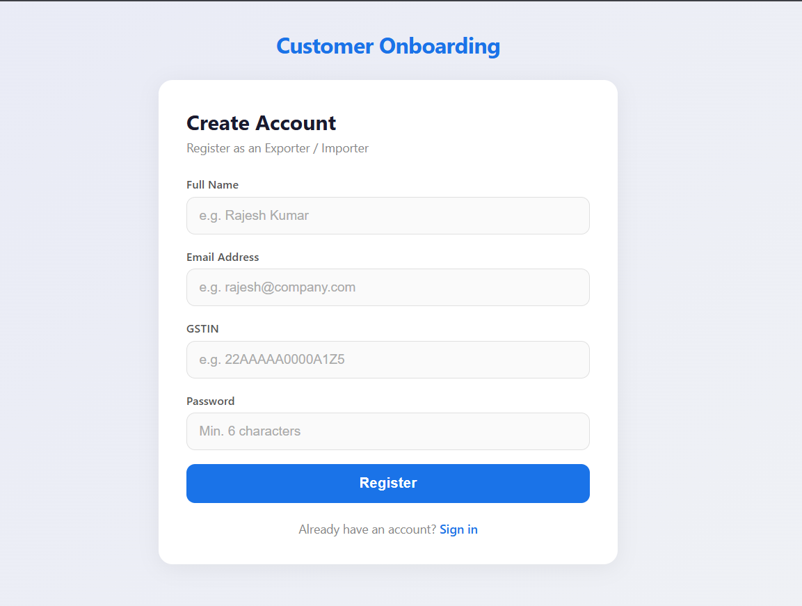
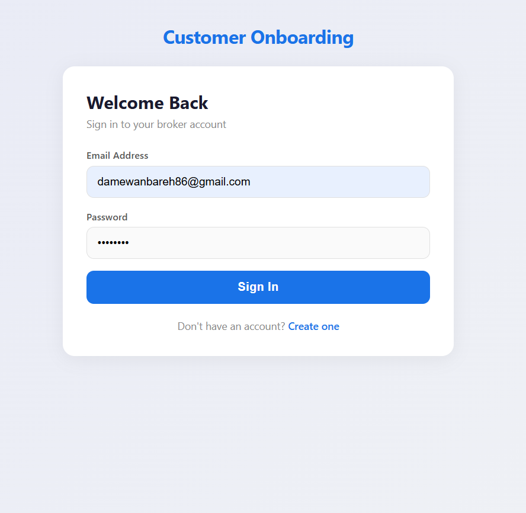
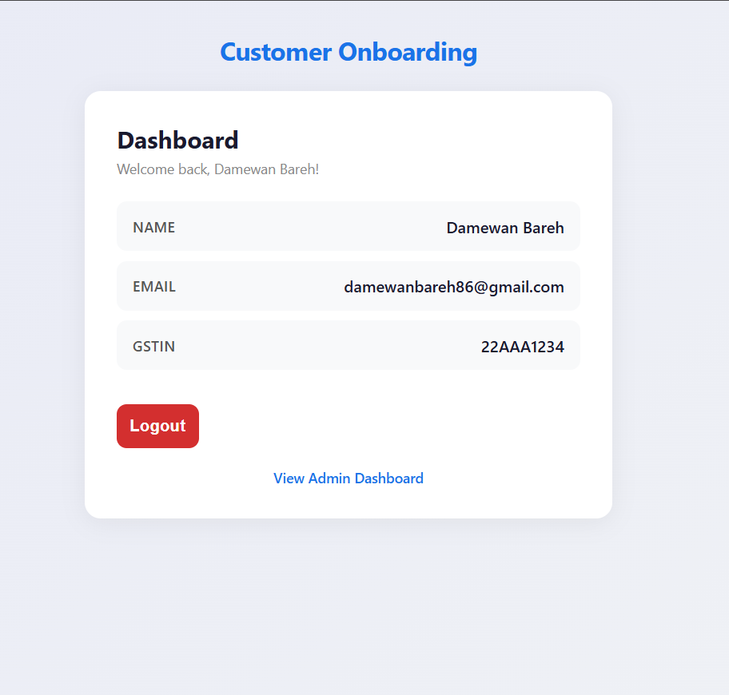
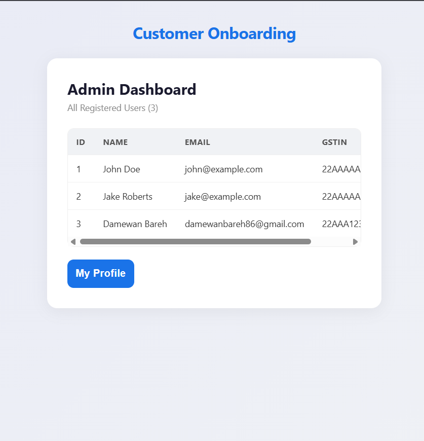
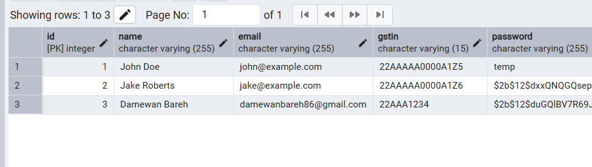

# 🚀 Customer Onboarding Workflow MVP

A full-stack **Customer Onboarding** application built for customs brokers to register, verify, and manage their exporter/importer clients. Built with **FastAPI**, **PostgreSQL**, and **React**.

---

## 📑 Table of Contents

- [Features](#-features)
- [Tech Stack](#-tech-stack)
- [Architecture](#-architecture)
- [Security](#-security)
- [API Endpoints](#-api-endpoints)
- [Database Schema](#-database-schema)
- [Screenshots](#-screenshots)
- [Getting Started](#-getting-started)
- [Project Structure](#-project-structure)

---

## ✨ Features

- **User Registration** — Name, Email, GSTIN, and password with client + server validation
- **Secure Authentication** — bcrypt password hashing + JWT token-based auth
- **User Dashboard** — View profile details after login
- **Admin Dashboard** — View all registered customers in a table/card layout
- **Responsive Design** — Mobile-friendly UI with adaptive layouts
- **End-to-End Flow** — Register → Login → Dashboard → Admin (seamless redirects)

---

## 🛠 Tech Stack

| Layer | Technology | Purpose |
|-------|-----------|---------|
| **Frontend** | React 18 + Vite 6 | SPA with fast HMR dev server |
| **Routing** | React Router DOM 6 | Client-side page navigation |
| **HTTP Client** | Axios | API calls with auth interceptor |
| **Backend** | FastAPI 0.115 | Async Python web framework |
| **ORM** | SQLAlchemy 2.0 (async) | Database models & queries |
| **Database** | PostgreSQL 17 | Relational data storage |
| **DB Driver** | asyncpg | Async PostgreSQL adapter |
| **Migrations** | Alembic | Database schema versioning |
| **Auth** | python-jose (JWT) | Token generation & validation |
| **Hashing** | passlib + bcrypt | Secure password hashing |
| **Validation** | Pydantic v2 | Request/response schema validation |

---

## 🏗 Architecture

```
┌────────────────────────────────────────────────────────────────┐
│                        CLIENT (Browser)                        │
│                                                                │
│   React 18 + Vite          React Router DOM 6                  │
│   ┌──────────┐  ┌──────────┐  ┌───────────┐  ┌──────────┐      │
│   │ Register │  │  Login   │  │ Dashboard │  │  Admin   │      │
│   │  Page    │  │  Page    │  │   Page    │  │  Page    │      │
│   └────┬─────┘  └────┬─────┘  └─────┬─────┘  └────┬─────┘      │
│        │              │              │              │          │
│        └──────────────┴──────────┬───┴──────────────┘          │
│                                  │                             │
│                        Axios HTTP Client                       │
│                   (Bearer Token Interceptor)                   │
└──────────────────────────────────┬──────────────────────────────┘
                                   │  HTTP/JSON
                                   ▼
┌──────────────────────────────────────────────────────────────────┐
│                    BACKEND (FastAPI Server)                      │
│                                                                  │
│  ┌──────────────────────────────────────────────────────────┐    │
│  │                    CORS Middleware                       │    │
│  │              (Allow: localhost:5173)                     │    │
│  └──────────────────────────┬───────────────────────────────┘    │
│                             │                                    │
│  ┌──────────────────────────▼───────────────────────────────┐    │
│  │                   Router: /customers                      │   │
│  │                                                           │   │
│  │  POST /register  ──→  Validate → Hash PW → Save to DB     │   │
│  │  POST /login     ──→  Verify PW → Generate JWT Token      │   │
│  │  GET  /profile   ──→  [Auth] → Return current user        │   │
│  │  GET  /all       ──→  [Auth] → Return all customers       │   │
│  └──────────┬────────────────────────────────┬───────────────┘   │
│             │                                │                   │
│  ┌──────────▼──────────┐      ┌──────────────▼───────────────┐   │
│  │  Security Layer     │      │   Dependency Injection       │   │
│  │  • bcrypt hashing   │      │   • get_db (async session)   │   │
│  │  • JWT encode/decode│      │   • get_current_customer     │   │
│  │  • Token validation │      │     (Bearer token → user)    │   │
│  └─────────────────────┘      └──────────────────────────────┘   │
│                                           │                      │
│                    ┌──────────────────────▼───────────────┐      │
│                    │      SQLAlchemy Async ORM            │      │
│                    │      (AsyncSession + asyncpg)        │      │
│                    └──────────────────────┬───────────────┘      │
└───────────────────────────────────────────┬──────────────────────┘
                                            │  TCP/5432
                                            ▼
                              ┌──────────────────────────┐
                              │     PostgreSQL 17        │
                              │                          │
                              │  Table: customers        │
                              │  ├─ id (PK, serial)      │
                              │  ├─ name (varchar 255)   │
                              │  ├─ email (unique)       │
                              │  ├─ gstin (unique)       │
                              │  └─ password (bcrypt)    │
                              │                          │
                              │  Managed by Alembic      │
                              └──────────────────────────┘
```

### Request Flow

1. **User** fills out the registration form in the React frontend
2. **Axios** sends a `POST` request to `/customers/register` with JSON payload
3. **FastAPI** validates the request via Pydantic schema (`CustomerCreate`)
4. **Router** checks for duplicate email/GSTIN in PostgreSQL
5. **Security layer** hashes the password with bcrypt
6. **SQLAlchemy** inserts the new customer record asynchronously
7. **Response** returns the customer data (without password) with HTTP 201
8. **Frontend** redirects to the login page with a success notification

---

## 🔒 Security

### Password Security

| Measure | Implementation |
|---------|---------------|
| **Hashing Algorithm** | bcrypt via passlib — industry-standard adaptive hashing |
| **No Plaintext Storage** | Passwords are hashed before database insertion; raw passwords are never stored |
| **Verification** | `passlib.context.verify()` compares submitted password against stored hash |
| **Salt** | bcrypt automatically generates a unique random salt per password |

### Authentication & Authorization

| Measure | Implementation |
|---------|---------------|
| **Token Type** | JWT (JSON Web Token) with HS256 signing algorithm |
| **Token Expiry** | 30-minute lifetime (configurable via `ACCESS_TOKEN_EXPIRE_MINUTES`) |
| **Token Transport** | `Authorization: Bearer <token>` header — not stored in cookies |
| **Protected Routes** | `/profile` and `/all` require valid JWT via `get_current_customer` dependency |
| **Token Payload** | Contains only `sub` (customer ID) and `exp` (expiration) — minimal claims |

### Input Validation

| Layer | Validation |
|-------|-----------|
| **Frontend** | GSTIN must be exactly 15 characters; password minimum 6 characters; HTML5 email validation |
| **Backend (Pydantic)** | `EmailStr` type for email format; required fields enforced by schema |
| **Backend (Database)** | Unique constraints on `email` and `gstin` columns; NOT NULL on all fields |
| **Error Responses** | Specific error messages: "Email already registered", "GSTIN already registered", "Invalid email or password" |

### API Security

| Measure | Implementation |
|---------|---------------|
| **CORS** | Restricted to `http://localhost:5173` (frontend origin only) |
| **No Password Leakage** | `CustomerResponse` schema excludes the password field from all API responses |
| **HTTP Status Codes** | 400 for validation errors, 401 for auth failures, 201 for successful creation |
| **Async Architecture** | Non-blocking I/O prevents thread-pool exhaustion under load |

### Secret Management

| Measure | Implementation |
|---------|---------------|
| **Environment Variables** | `DATABASE_URL` and `SECRET_KEY` loaded from `.env` file |
| **Git Ignored** | `.env` is in `.gitignore` — secrets never committed to version control |
| **Example Provided** | `.env.example` documents required variables without exposing real values |

---

## 📡 API Endpoints

| Method | Endpoint | Auth | Description |
|--------|----------|------|-------------|
| `POST` | `/customers/register` | No | Register a new customer |
| `POST` | `/customers/login` | No | Authenticate and receive JWT |
| `GET` | `/customers/profile` | Bearer Token | Get current user's profile |
| `GET` | `/customers/all` | Bearer Token | Get all registered customers |
| `GET` | `/` | No | Root welcome endpoint |
| `GET` | `/health` | No | Health check |

### Example: Register

```bash
curl -X POST http://localhost:8000/customers/register \
  -H "Content-Type: application/json" \
  -d '{
    "name": "John Doe",
    "email": "john@example.com",
    "gstin": "22AAAAA0000A1Z5",
    "password": "securepass123"
  }'
```

**Response (201):**
```json
{
  "id": 1,
  "name": "John Doe",
  "email": "john@example.com",
  "gstin": "22AAAAA0000A1Z5"
}
```

### Example: Login

```bash
curl -X POST http://localhost:8000/customers/login \
  -H "Content-Type: application/json" \
  -d '{
    "email": "john@example.com",
    "password": "securepass123"
  }'
```

**Response (200):**
```json
{
  "access_token": "eyJhbGciOiJIUzI1NiIs...",
  "token_type": "bearer"
}
```

---

## 🗄 Database Schema

```sql
CREATE TABLE customers (
    id       SERIAL       PRIMARY KEY,
    name     VARCHAR(255) NOT NULL,
    email    VARCHAR(255) NOT NULL UNIQUE,
    gstin    VARCHAR(15)  NOT NULL UNIQUE,
    password VARCHAR(255) NOT NULL  -- bcrypt hash
);
```

Managed via **Alembic** async migrations:
- `ba6a37d826b7` — Create customers table
- `608b204b1412` — Add password column

---

## 📸 Screenshots


### Registration Page


### Login Page


### User Dashboard


### Admin Dashboard


### Database Entries


---

## 🚀 Getting Started

### Prerequisites

- **Python 3.10+**
- **Node.js 18+**
- **PostgreSQL 17**

### 1. Clone the repository

```bash
git clone https://github.com/<your-username>/customer-onboarding.git
cd customer-onboarding
```

### 2. Backend setup

```bash
cd backend

# Create virtual environment
python -m venv venv
venv\Scripts\activate        # Windows
# source venv/bin/activate   # macOS/Linux

# Install dependencies
pip install -r requirements.txt

# Configure environment
copy .env.example .env
# Edit .env with your PostgreSQL credentials and a strong SECRET_KEY
```

### 3. Database setup

```bash
# Create the database in psql
psql -U postgres -c "CREATE DATABASE customer_onboarding;"

# Run migrations
alembic upgrade head
```

### 4. Start the backend

```bash
uvicorn app.main:app --reload
# Server runs at http://localhost:8000
# API docs at http://localhost:8000/docs
```

### 5. Frontend setup

```bash
cd ../frontend

# Install dependencies
npm install

# Start dev server
npm run dev
# App runs at http://localhost:5173
```

---

## 📁 Project Structure

```
Customer Onboarding/
├── backend/
│   ├── alembic/                  # Database migration scripts
│   │   ├── versions/
│   │   │   ├── ba6a37d826b7_create_customers_table.py
│   │   │   └── 608b204b1412_add_password_column.py
│   │   └── env.py                # Async Alembic config
│   ├── app/
│   │   ├── models/
│   │   │   └── customer.py       # SQLAlchemy Customer model
│   │   ├── routers/
│   │   │   └── customer.py       # API route handlers
│   │   ├── schemas/
│   │   │   └── customer.py       # Pydantic request/response schemas
│   │   ├── config.py             # Environment settings
│   │   ├── database.py           # Async engine & session
│   │   ├── deps.py               # Auth dependency (get_current_customer)
│   │   ├── main.py               # FastAPI app entrypoint
│   │   └── security.py           # bcrypt hashing & JWT utilities
│   ├── .env.example              # Environment template
│   ├── alembic.ini               # Alembic configuration
│   └── requirements.txt          # Python dependencies
├── frontend/
│   ├── src/
│   │   ├── pages/
│   │   │   ├── Register.jsx      # Registration form
│   │   │   ├── Login.jsx         # Login form
│   │   │   ├── Dashboard.jsx     # User profile view
│   │   │   └── Admin.jsx         # All customers table
│   │   ├── api.js                # Axios client + auth interceptor
│   │   ├── App.jsx               # Router configuration
│   │   ├── index.css             # Global styles (responsive)
│   │   └── main.jsx              # React entry point
│   ├── index.html                # HTML shell
│   ├── package.json              # Node dependencies
│   └── vite.config.js            # Vite dev server config
├── screenshots/                  # Application screenshots
├── .gitignore
└── README.md
```

---

## 👤 Author

Built as part of the **Full Stack Developer** assessment task.

Co-authored-by: **GitHub Copilot**
